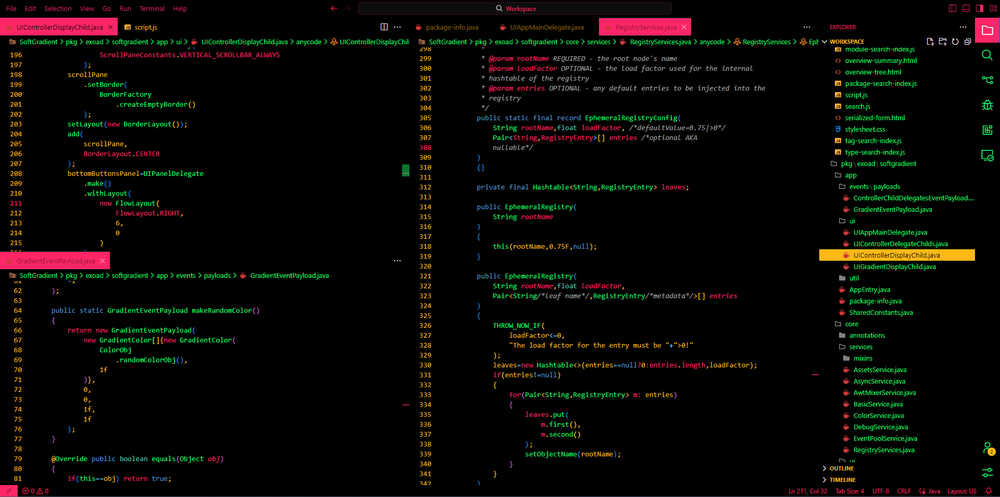

<h1 align="center">Poprock-vscode</h1>

  

  
A vibrant dark theme using <a href="https://github.com/exoad/Design/tree/masta/poprock">my poprock theme</a>
 
 

 
 

  

## Installing

### Marketplace

Simply search for `poprock theme` or head over to my publisher page [here](https://marketplace.visualstudio.com/publishers/exoad)

### Local

> [!WARNING]
> I do not recommend using this method to install the theme

If you do not wish to go through the Microsft VSCode Marketplace, you can simply inject the properties found in [`repo/settings.json`](./repo/settings.json) into your own `settings.json`.

## Acknowledgement

**Theme Studio**

Link: https://themes.vscode.one/
